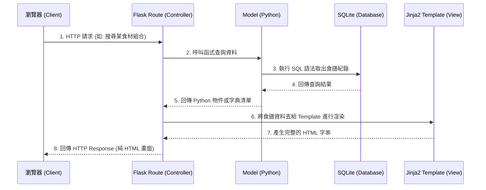

# 系統架構文件 (Architecture)

本文件根據 [食譜收藏夾系統 PRD](PRD.md) 的需求，規劃專案的技術架構、資料夾結構與元件職責。

## 1. 技術架構說明

本專案採用經典的 Web 應用程式架構，不進行前後端分離，由後端直接渲染 HTML 頁面。

### 選用技術與原因
- **後端框架：Flask (Python)** 
  - **原因**：Flask 是輕量級且高彈性的 Python Web 框架，非常適合中小型專案或 MVP 的快速迭代。它對新手友善且生態系豐富（有許多延伸套件如 Flask-Login, Flask-SQLAlchemy 可利後續擴增）。
- **前端模板：Jinja2**
  - **原因**：Jinja2 是 Flask 內建的預設模板引擎，能無縫整合 Python 資料結構。它允許我們在 HTML 內使用條件判斷與迴圈，有效率地渲染食譜列表、食材清單等動態內容。
- **資料庫：SQLite**
  - **原因**：SQLite 為輕量級的關聯式資料庫，無需設置獨立資料庫伺服器，資料儲存於單一檔案中，易於備份與轉移。對於初期預期資料量不龐大的 MVP，是開發與維護上最輕量的選擇。

### Flask MVC (MTV) 模式說明
在我們的 Flask 架構中，會以類似 MVC（在 Python/Django 圈常稱為 MTV: Model-Template-View）的模式來劃分職責：
- **Model (模型)**：負責定義資料結構與資料庫的操作（如：食譜 `Recipe`、食材 `Ingredient` 模型），並處理資料的讀寫。
- **View (視圖/模板 - Jinja2)**：負責使用者介面（UI）的呈現，將後端傳遞過來的資料渲染成 HTML。
- **Controller (控制器/路由 - Flask Route)**：處理使用者的 HTTP 請求（GET, POST 等），接收輸入（如食譜搜尋條件），呼叫對應的 Model 取得或存取資料，最後將資料傳遞給 Jinja2 模板進行渲染。

---

## 2. 專案資料夾結構

本專案為使後續管理更清晰，將設定標準的 Flask 目錄結構，將路由、資料庫模型與前端資源分開管理。

```text
web_app_development/
├── app/                        # 應用程式主目錄
│   ├── __init__.py             # 初始化 Flask 應用與註冊 Blueprint
│   ├── models.py               # 資料庫模型設計 (Model) / 如 Recipe, User
│   ├── routes.py               # 路由與業務邏輯 (Controller)
│   ├── templates/              # HTML 模板目錄 (View)
│   │   ├── base.html           # 全站共用的基礎模板 (Navbar, Footer 等)
│   │   ├── index.html          # 首頁 (顯示最新/推薦食譜)
│   │   ├── recipe.html         # 單一食譜詳細頁面 (含份量換算)
│   │   └── search.html         # 搜尋結果頁面 (對應食材組合搜尋)
│   └── static/                 # 靜態資源目錄
│       ├── css/                # 樣式表 (style.css)
│       ├── js/                 # 前端互動邏輯 (如處理份量換算腳本)
│       └── images/             # 系統預設圖片與使用者上傳的食譜圖片
├── instance/                   # 存放本機端產生的實體檔案（不進版控）
│   └── database.db             # SQLite 資料庫檔案
├── docs/                       # 專案文件
│   ├── PRD.md                  # 產品需求文件
│   └── ARCHITECTURE.md         # 系統架構文件 (本文件)
├── requirements.txt            # Python 套件依賴清單
└── app.py                      # 系統執行入口點 (啟動 Flask Server)
```

---

## 3. 元件關係圖

以下展示使用者從瀏覽器發出請求後，系統各元件的互動關係。



---

## 4. 關鍵設計決策

1. **整合式路由管理 (`routes.py`) 還是 Blueprint**
   - **決策**：初期 MVP 範圍尚小，我們將主要路由統一放置於 `routes.py`。若後續擴增「管理員後台頁面」或「社群分享」，可進一步導入 Flask Blueprint 將前台與後台路由分離。
   - **原因**：降低初期的開發複雜度，減少不必要的結構過度設計。

2. **前端互動實作層級 (如：份量換算功能)**
   - **決策**：份量自動換算功能將透過前端 JavaScript 於客戶端即時計算並更新畫面。
   - **原因**：這樣可以避免每次使用者調整份量時都需要重新整理頁面或發送請求到後端，能提供最即時、流暢的使用者體驗。

3. **使用 SQLAlchemy 還是原生 `sqlite3`**
   - **決策**：建議採用 `Flask-SQLAlchemy` 作為 ORM (Object Relational Mapping)。
   - **原因**：雖然原生 `sqlite3` 較為直接，但 ORM 能讓我們用 Python 物件的方式來操作關聯式資料（如：`recipe.ingredients`），這對開發包含「食譜、食材、採買清單」等複雜關聯資料時尤其方便，也可防止直接寫 SQL 字串可能帶來的 SQL Injection 漏洞。

4. **食譜圖片存放與存取方式**
   - **決策**：使用者上傳的圖片將存放在伺服器本地端 `app/static/images/` 資料夾內，資料庫內僅存放「檔案路徑」。
   - **原因**：考量目前僅作為 MVP 驗收，無須額外串接 AWS S3 等雲端存儲服務。資料庫僅存路徑亦能避免資料庫檔案過度膨脹，維持查詢效能。
