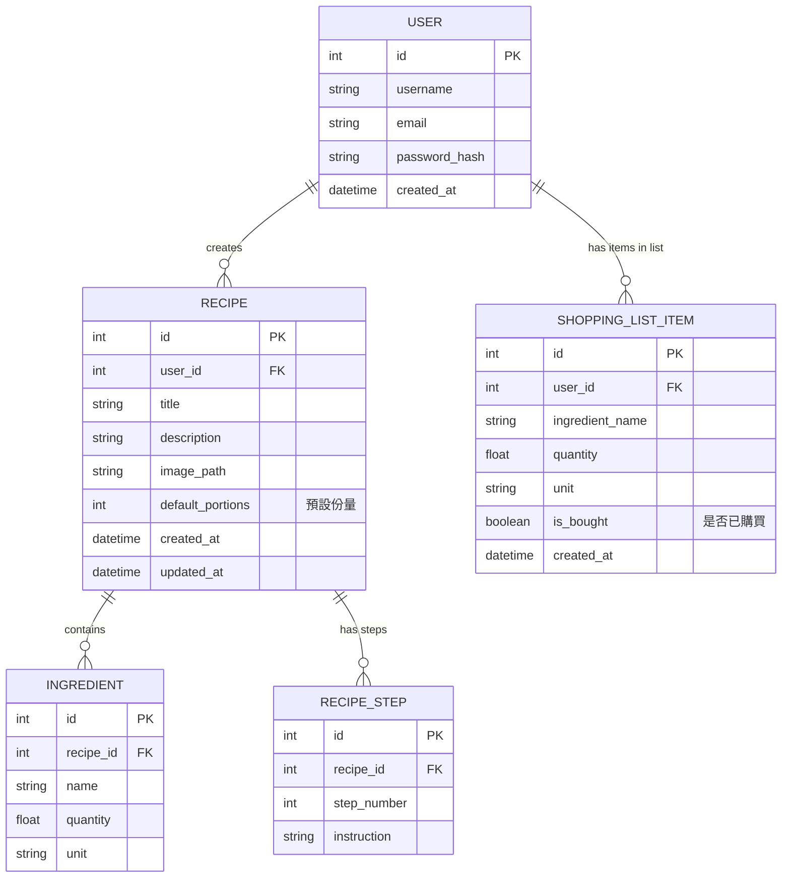

# 資料庫設計文件 (DB Design)

本文件根據產品需求文件 (PRD) 與流程圖 (FLOWCHART)，定義「食譜收藏夾系統」的資料庫結構。本專案使用 SQLite 與 Flask-SQLAlchemy 進行實作。

## 1. ER 圖（實體關係圖）

## 2. 資料表詳細說明

### 2.1 USER (使用者)
儲存使用者的登入資訊。
- `id` (INTEGER): Primary Key，自動遞增。
- `username` (VARCHAR): 使用者名稱，必填，唯一。
- `email` (VARCHAR): 信箱，必填，唯一。
- `password_hash` (VARCHAR): 加密後的密碼，必填。
- `created_at` (DATETIME): 建立時間。

### 2.2 RECIPE (食譜)
儲存食譜的基本資訊。
- `id` (INTEGER): Primary Key，自動遞增。
- `user_id` (INTEGER): Foreign Key 關聯至 USER，代表建立者，必填。
- `title` (VARCHAR): 食譜名稱，必填。
- `description` (TEXT): 食譜簡介。
- `image_path` (VARCHAR): 圖片存放路徑 (預設可為 null)。
- `default_portions` (INTEGER): 預設份量 (例如 2 人份)，必填。
- `created_at` (DATETIME): 建立時間。
- `updated_at` (DATETIME): 最後更新時間。

### 2.3 INGREDIENT (食材)
儲存特定食譜所需的食材。
- `id` (INTEGER): Primary Key，自動遞增。
- `recipe_id` (INTEGER): Foreign Key 關聯至 RECIPE，必填。
- `name` (VARCHAR): 食材名稱，必填。
- `quantity` (FLOAT): 數量 (為了份量換算，採用浮點數)，必填。
- `unit` (VARCHAR): 單位 (如「克」、「顆」、「毫升」)，可為空白。

### 2.4 RECIPE_STEP (食譜步驟)
儲存食譜的烹飪步驟。
- `id` (INTEGER): Primary Key，自動遞增。
- `recipe_id` (INTEGER): Foreign Key 關聯至 RECIPE，必填。
- `step_number` (INTEGER): 步驟順序，必填。
- `instruction` (TEXT): 步驟說明內容，必填。

### 2.5 SHOPPING_LIST_ITEM (購買清單項目)
儲存使用者加入購買清單的食材。
- `id` (INTEGER): Primary Key，自動遞增。
- `user_id` (INTEGER): Foreign Key 關聯至 USER，必填。
- `ingredient_name` (VARCHAR): 食材名稱，必填。
- `quantity` (FLOAT): 數量，必填。
- `unit` (VARCHAR): 單位。
- `is_bought` (BOOLEAN): 標記是否已打勾買過，預設為 False。
- `created_at` (DATETIME): 加入清單的時間。
