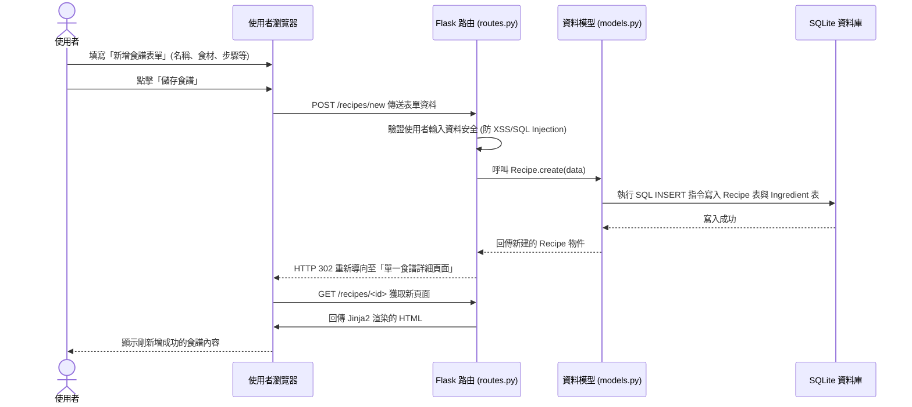

# 流程圖文件 (Flowchart)

本文件根據 [PRD](PRD.md) 與 [系統架構](ARCHITECTURE.md)，視覺化呈現「食譜收藏夾系統」的使用者操作路徑與系統內部的資料流動。

## 1. 使用者流程圖 (User Flow)

這張圖描述了使用者進入網站後，如何瀏覽頁面與操作各項核心功能。

```mermaid
flowchart LR
    Start([使用者到達網站]) --> Home[首頁 (最新與推薦食譜)]
    
    Home --> Nav{使用者想做什麼？}
    
    %% 瀏覽與搜尋路線
    Nav -->|瀏覽食譜| Browse[食譜列表頁]
    Nav -->|關鍵字搜尋| KeywordSearch[輸入關鍵字搜尋]
    Nav -->|食材組合搜尋| IngreSearch[輸入多種食材搜尋]
    
    KeywordSearch --> SearchResult[搜尋結果列表]
    IngreSearch --> SearchResult
    Browse --> SearchResult
    
    SearchResult -->|點擊食譜| RecipeDetail[食譜詳細頁面]
    
    %% 食譜內頁操作
    RecipeDetail --> Action{食譜頁面操作}
    Action -->|切換份量| CalcPortion[前端 JavaScript 動態換算份量]
    Action -->|加入清單| AddToList[一鍵加入購買清單]
    
    %% 個人管理路線
    Nav -->|管理個人食譜| DashBoard[個人收藏夾面板]
    DashBoard --> AddRecipe[新增食譜表單]
    DashBoard --> EditRecipe[編輯食譜]
    DashBoard --> DeleteRecipe[刪除食譜]
    DashBoard --> ViewList[檢視購買清單]
```

## 2. 系統序列圖 (Sequence Diagram)

這涵蓋了「使用者新增與儲存一筆食譜」的完整底層系統流程，描述資料在客戶端與伺服器間的來回。



## 3. 功能清單對照表

以下整理了核心功能的對應 URL 結構與 HTTP 方法，作為後續 API 設計的參考基礎。

| 功能名稱 | URL 路徑 | HTTP 方法 | 說明 |
| --- | --- | --- | --- |
| 瀏覽/首頁推薦 | `/` | GET | 顯示首頁、最新加入的食譜列表 |
| 關鍵字/食材搜尋 | `/search` | GET | 透過 query parameter (`?q=...` 或是 `?ingredients=...`) 傳送搜尋條件 |
| 新增食譜頁面 | `/recipes/new` | GET | 顯示「新增食譜」的空白表單 |
| 送出新增食譜 | `/recipes/new` | POST | 接收表單資料並存入資料庫 |
| 查看單一食譜 | `/recipes/<id>` | GET | 顯示指定 ID 的食譜，包含此頁面的份量動態換算 |
| 編輯單一食譜 | `/recipes/<id>/edit` | GET/POST | GET 抓取舊資料顯示在表單，POST 用來送出更新 |
| 刪除單一食譜 | `/recipes/<id>/delete`| POST | 刪除指定 ID 的食譜 (用 POST 確保安全防誤刪) |
| 購買清單管理 | `/list` | GET | 檢視當前使用者的購買清單 |
| 一鍵加入清單 | `/list/add/<recipe_id>`| POST | 將該食譜的食材加入這名用戶的總購買清單中 |
